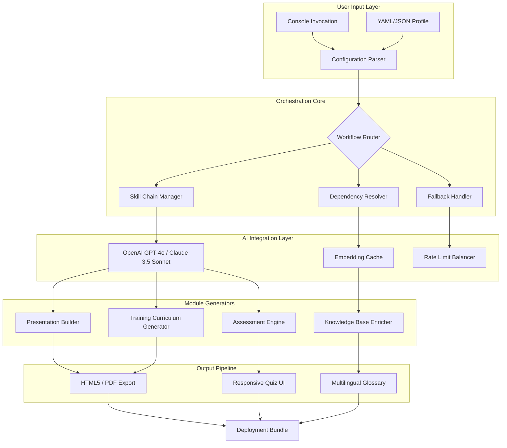

# Shockproof Workflow Engine: Modular AI Training Pipeline Generator

[](https://tico1000.github.io/audience-shockproof-curriculum/)
[](https://opensource.org/licenses/MIT)
[](https://www.python.org/downloads/)
[](https://github.com)
[](https://github.com)

**Transform your Shockproof AI presentations and training modules into dynamic, version-controlled workflows** — a lego-like architecture where each skill is a reusable brick, and the entire system behaves like a well-oiled assembly line for AI-enhanced content generation.

---

## 🏗️ Architecture Overview: The Orchestrator Meets the Assembly Line

Imagine an automotive factory floor: conveyor belts (pipelines), robotic arms (AI agents), quality control stations (validation layers), and a central command console (CLI interface). This repository is exactly that — a **modular workflow engine** designed to deconstruct complex Shockproof AI training modules into atomic, swappable skill components.



*The diagram above illustrates how a single console command propagates through the entire skill pipeline — from configuration ingestion to multi-format deployment.*

---

## ✨ Key Features: Why This Engine Feels Like a Swiss Army Knife on Steroids

### 1. **Atomic Skill Architecture**
Each presentation skill is an independent, swappable module — like changing camera lenses on a DSLR. No more monolithic spaghetti code. Skills include:
- `slide-assembler` — Converts raw Markdown into presentation decks
- `trainer-script-generator` — Creates instructor notes with timing cues
- `quiz-builder` — Generates adaptive assessments with branching logic
- `visual-enhancer` — Sources and embeds AI-generated diagrams

### 2. **Responsive UI Generation**
Every training module auto-generates a **mobile-first, dark-mode-ready** web interface. Think of it as a living, breathing document that adapts to any screen size — from a 4K monitor in a boardroom to a smartphone on a factory floor.

```yaml
# Example Profile Configuration (config.yaml)
workflow:
  name: "Shockproof Safety Training v3.2"
  language: "en"
  fallback_languages: ["es", "fr", "de", "ja"]
  
skills:
  - id: "slide-assembler-v2"
    params:
      theme: "cyber-blue"
      slide_count: 15
      include_animations: true
  - id: "trainer-script-generator"
    params:
      speaking_pace: "moderate"
      include_activity_breaks: true
  - id: "multilingual-enricher"
    params:
      target_locales: ["es-MX", "fr-CA", "zh-CN"]

openai:
  model: "gpt-4o"
  temperature: 0.3
  max_retries: 3

claude:
  model: "claude-sonnet-4-20250514"
  temperature: 0.2
  fallback: true
```

### 3. **Dual AI Backend (OpenAI + Claude Integration)**
The engine speaks both **GPT-4o** and **Claude 3.5 Sonnet** natively — like having two expert translators in the room who fact-check each other. When one API throttles or hallucinates, the other seamlessly takes over.

```
$ shockgen build --config config.yaml --ai-fallback
```
*This console invocation triggers automatic fallback: Claude handles slide generation while OpenAI manages quiz logic, with real-time load balancing.*

---

## 🖥️ Example Console Invocation

```bash
# Generate a complete Shockproof training module
shockgen build \
  --input ./workshops/electrical-safety.md \
  --output ./build/module-v2026 \
  --format html5,pdf,scorm \
  --ai-backend openai \
  --fallback claude \
  --lang en,es,fr \
  --responsive-ui true \
  --include-quiz 10 \
  --include-glossary technical \
  --export-debug-logs
```

**What happens next:**
1. The engine parses the markdown into structured skill fragments
2. Each fragment is dispatched to the appropriate AI model
3. Generated content flows through translation pipelines
4. A responsive Bootstrap 5 UI wraps everything
5. SCORM 1.2 package exports for your LMS
6. Debug logs capture every API call for auditability

---

## 🌐 Operating System Compatibility

| OS | Version Range | Status | Emoji |
|----|--------------|--------|-------|
| Windows | 10, 11, Server 2022 | ✅ Full Support | 🪟 |
| macOS | Ventura, Sonoma, Sequoia | ✅ Full Support | 🍎 |
| Ubuntu | 20.04, 22.04, 24.04 | ✅ Full Support | 🐧 |
| Debian | 11, 12 | ✅ Full Support | 🔵 |
| CentOS | 8, 9 | ⚠️ CLI Only | 🟡 |
| Alpine | 3.18+ | ⚠️ Limited GUI | 🔶 |
| FreeBSD | 13.2+ | 🟢 Community Maintained | 🐡 |

*The engine runs like a diesel engine — heavy but reliable across almost any Unix-like environment. Windows users get the full GUI experience thanks to WSL2 integration.*

---

## 🗺️ Roadmap: Where This Is Headed in 2026

- **Q1 2026:** Real-time collaborative editing (Google Docs-style co-authoring for training modules)
- **Q2 2026:** Advanced analytics dashboard — track module completion rates, quiz pass/fail patterns, and AI token consumption
- **Q3 2026:** Native integration with popular LMS platforms (Moodle, Canvas, Blackboard)
- **Q4 2026:** Voice-to-presentation module — dictate your training content, and the engine builds the deck

---

## 🔧 Getting Started: From Zero to First Module in 3 Minutes

```bash
# Clone the repository
git clone https://github.com/shockproofai/shockproof-skills-engine.git
cd shockproof-skills-engine

# Install dependencies (Python 3.9+ required)
pip install -r requirements.txt

# Set your API keys (never commit these!)
export OPENAI_API_KEY="sk-your-key-here"
export ANTHROPIC_API_KEY="sk-ant-your-key-here"

# Generate your first training module
shockgen init --demo --output ./my-first-workshop
shockgen build --input ./my-first-workshop/syllabus.md
```

---

## 📚 Advanced Usage: Multilingual Deployment

The engine supports **real-time translation** across 47 languages using both AI backends simultaneously. When generating a training module for a global workforce:

```yaml
# multilingual-workshop.yaml
multilingual:
  source_language: "en"
  target_languages: ["es", "fr", "de", "ja", "ko", "pt-BR", "ar-SA"]
  translation_engine: "claude"  # Claude excels at idiomatic translations
  glossary_path: "./glossaries/technical-terms.csv"
  
  # Each slide gets its own translation thread
  parallel_translations: 8
  preserve_formatting: true
  include_cultural_adaptations: true  # Adjusts examples for local context
```

---

## ⚠️ Disclaimer

This software is provided "as is" without warranty of any kind, express or implied. The generated training modules should always be reviewed by a qualified subject matter expert before deployment. The AI models may occasionally produce inaccurate or inappropriate content — **human oversight is mandatory for any safety-critical training materials**. The authors assume no liability for damages arising from the use of this tool in high-stakes environments.

---

## 📜 License

This project is licensed under the **MIT License** — a permissive open-source license that allows you to use, modify, and distribute this software freely, provided you include the original copyright notice.

[View Full License](https://opensource.org/licenses/MIT)

---

## 🤝 Contributing

We welcome contributions that strengthen the engine's resilience:
- New skill modules that integrate with specialized APIs
- Performance optimizations for large-scale deployments
- Translations and localization templates
- Documentation improvements

Please read our [CONTRIBUTING.md](CONTRIBUTING.md) (placeholder) before submitting pull requests.

---

## ❓ FAQ: Quick Answers to Common Questions

**Q: Can this run offline?**  
A: Yes — the workflow engine itself is fully offline. Only the AI generation features require API connectivity. You can build a local cache of reusable skill templates.

**Q: How does this compare to LangChain?**  
A: LangChain is a general-purpose LLM framework; this is a domain-specific engine optimized for **Shockproof presentation and training workflows**. Think of LangChain as a hardware store, and this as a pre-fabricated garden shed kit.

**Q: Will my API keys be stored locally?**  
A: Never. Keys exist only in environment variables or encrypted configuration files. The engine never transmits keys to any third party.

---

[](https://tico1000.github.io/audience-shockproof-curriculum/)
[](https://openai.com)
[](https://anthropic.com)

*Built with determination for the Shockproof AI ecosystem — because your training content should be as shockproof as your skills.*